# Laporan Project Remastering Cubic

<h4>Nama  : Fafiq Lutfi Azana<h4>
<h4>NIM   : 254107020058<h4>
<h4>Kelas : TI-1G<h4>

## Pendahuluan
Project remastering file ISO ubuntu ini saya menggunakan CUBIC yang langsung dijalankan di dalam ubuntu (24.0.4) yang terinstall di komputer saya. Saya menggunakan file ISO 24.0.4 yang saya dapatkan di arsip. Sebenarnya pada waktu project ini dijalankan, Ubuntu LTS sudah update ke versi 26, tetapi karena pada jobsheet ubuntu yang digunakan adalah versi 24, maka saya menggunakan versi tersebut, sesuai dengan instruksi di jobsheet.

### Langkah 1
Download file iso dan masuk ke virtual environment CUBIC

### Langkah 2
Update repository menggunakan command
```
apt update

apt upgrade
```

### Langkah 3
Install aplikasi yang diinginkan menggunakan command. Apliaksi yang diminta adalah VLC, gimp, Apache 2, php, dan VScode. Karena VScode tidak ada di package bawaan ubuntu, maka instalasi VScode akan dilakukan secara terpisah.
```
apt install -y vlc gimp apache2 php libapache2-mod-php
```

### Langkah 4
Instalasi VScode menggunakan wget untuk mendapatkan file .deb dari VScode, karena VScode tidak ada di package bawaan ubuntu.
```
wget -O vscode.deb "https://code.visualstudio.com/sha/download?build=stable&os=linux-deb-x64"

apt install -y ./vscode.deb
```

### Langkah 5
Membuat bash program sederhana untuk melihat informasi hardware.
#### 1. Buat file script dengan nama infohardware dengan ekstensi .sh (shell)
```
nano /usr/local/bin/infohardware.sh
```

#### 2. Masukan script
```
#!/bin/bash

clear

echo "========================================"
echo "      INFORMASI PERANGKAT KERAS"
echo "========================================"

echo ""
echo "[1] Informasi CPU"
echo "----------------------------------------"
lscpu | grep "Model name"
lscpu | grep "^CPU(s)"

echo ""
echo "[2] Informasi RAM"
echo "----------------------------------------"
free -h

echo ""
echo "[3] Informasi Storage"
echo "----------------------------------------"
df -h /

echo ""
echo "========================================"
echo "          SELESAI"
echo "========================================"
```

#### 3. Buat file infohardware menjadi executable
```
chmod +x /usr/local/bin/infohardware.sh
```

### Langkah 6
Mengubah tampilan dengan tema papirus dan yaru
```
apt install -y papirus-icon-theme
apt install -y yaru-theme-gtk-yaru-theme-icon
```

### Langkah 7
Ganti Wallpaper
```
cd/usr/share/backgrounds

wget -O wallpaper.jpg "https://images.unsplash.com/photo-1506744038136-46273834b3fb?w=1920"

gsettings set org.gnome.desktop.background picture-uri \ "file:///usr/share/backgrounds/wallpaper.jpg"

gsettings set org.gnome.desktop.background picture-uri-dark \ "file:///usr/share/backgrounds/wallpaper.jpg"
```

### Langkah 8
Generate ISO. Tahap ini adalah tahap membuat ISO baru yang sudah melakukan perubahan yang sesuai dengan apa yang diubah di dalam virtual environment

### Lampiran gambar
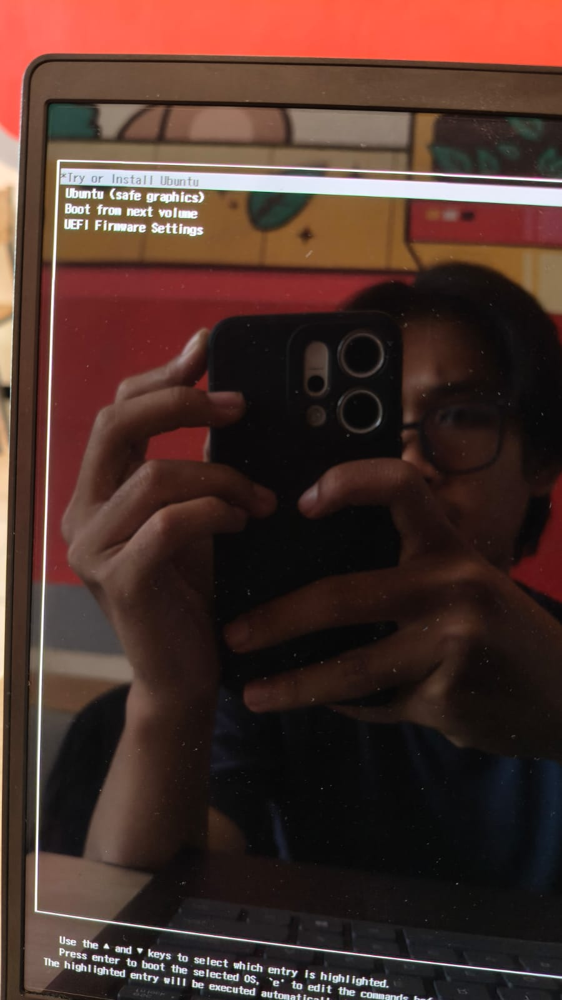
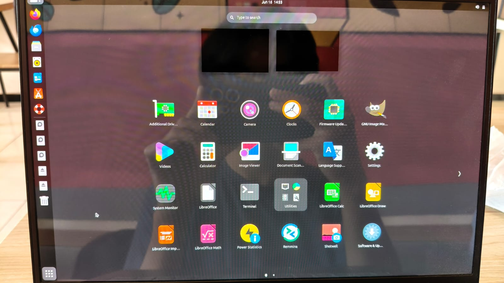
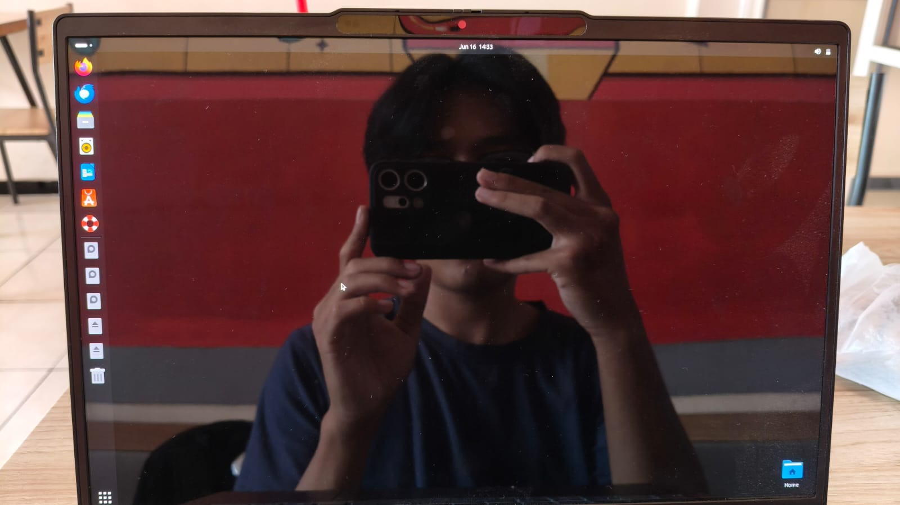
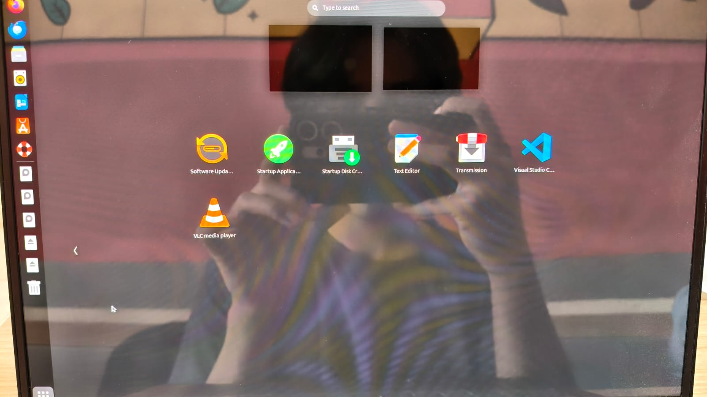
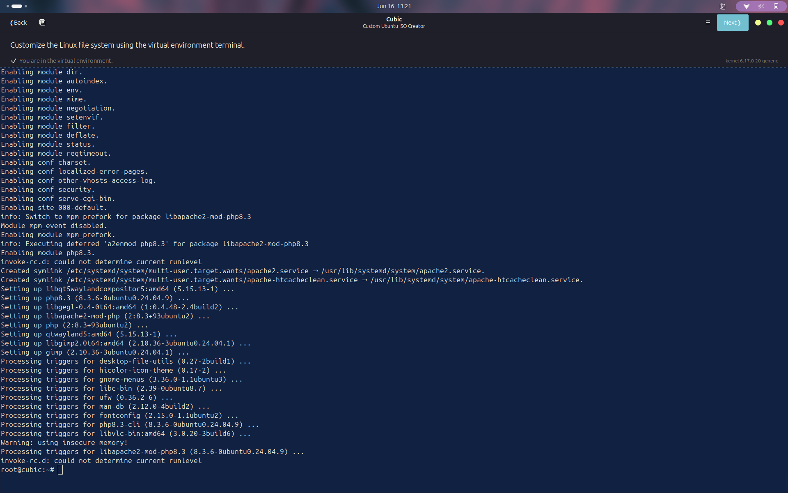
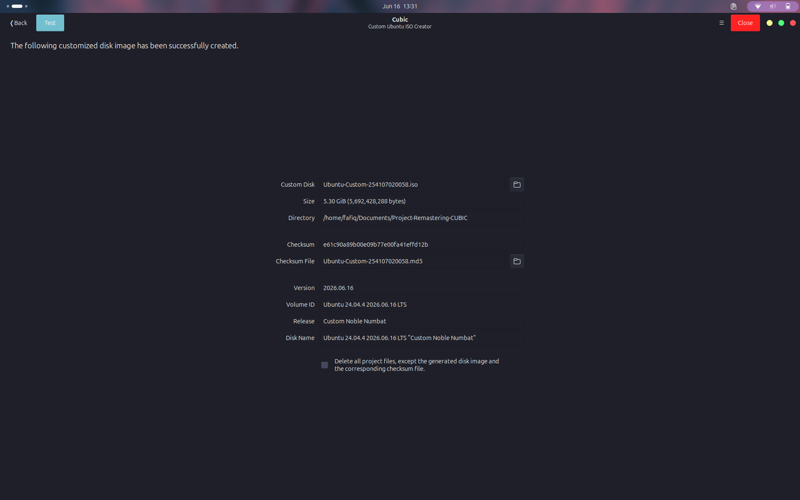
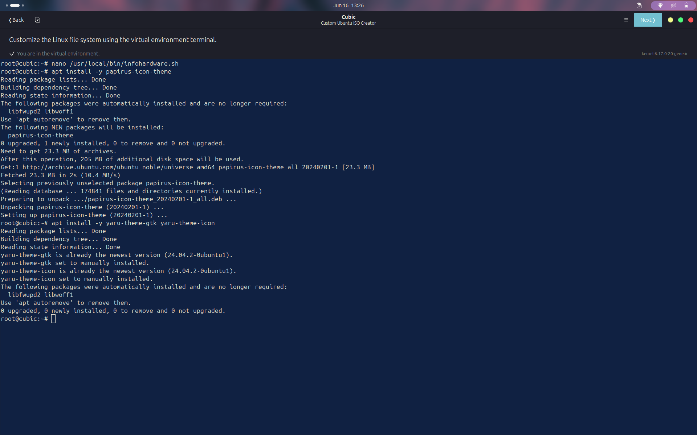
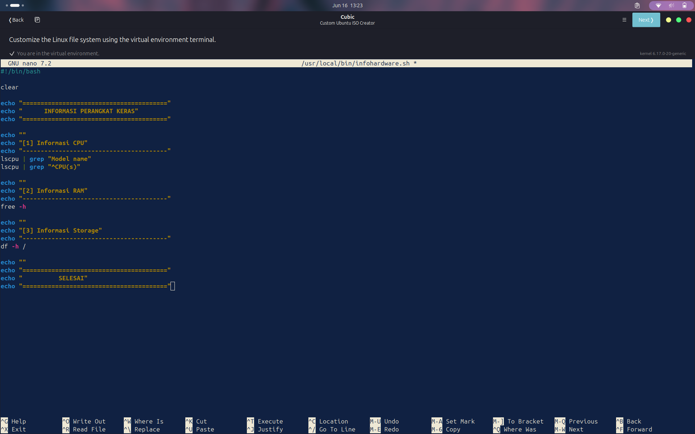
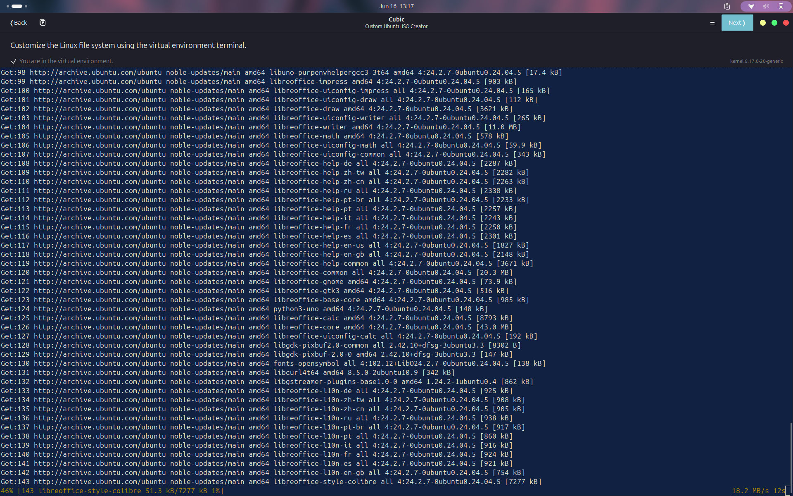
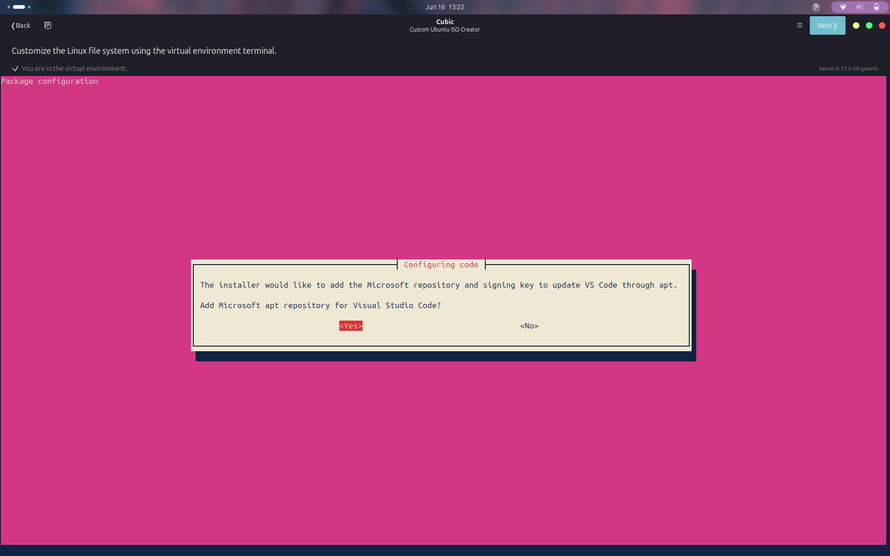
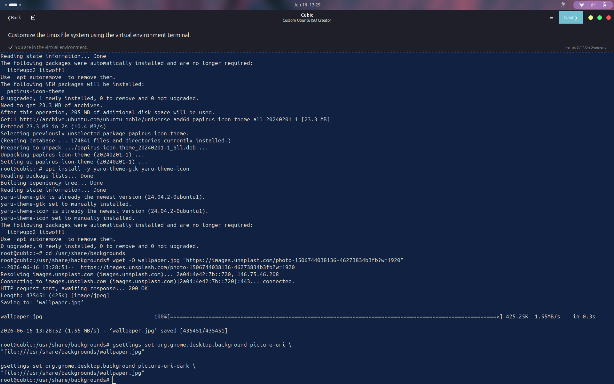
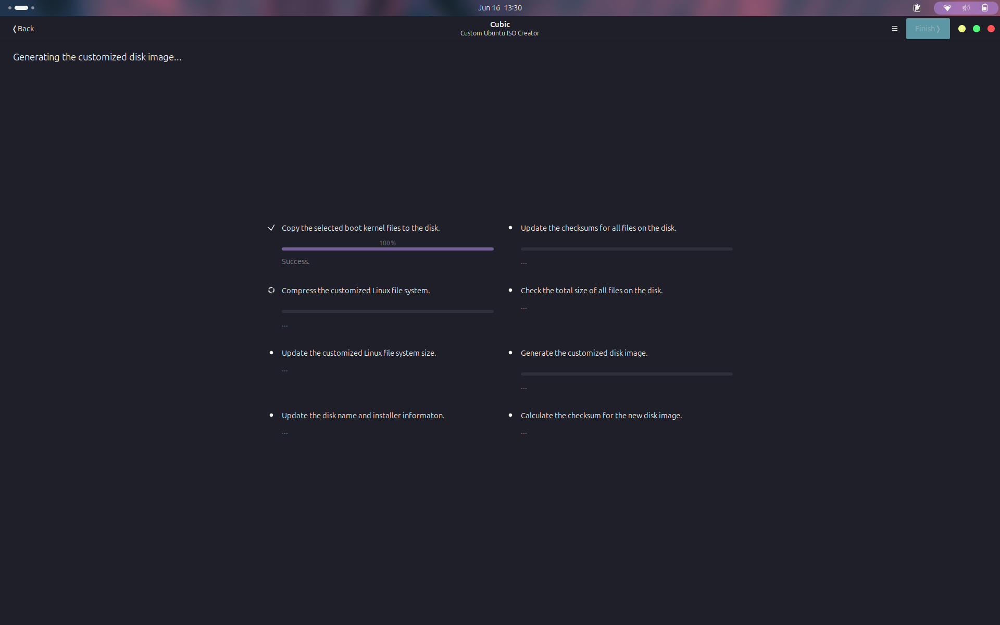
