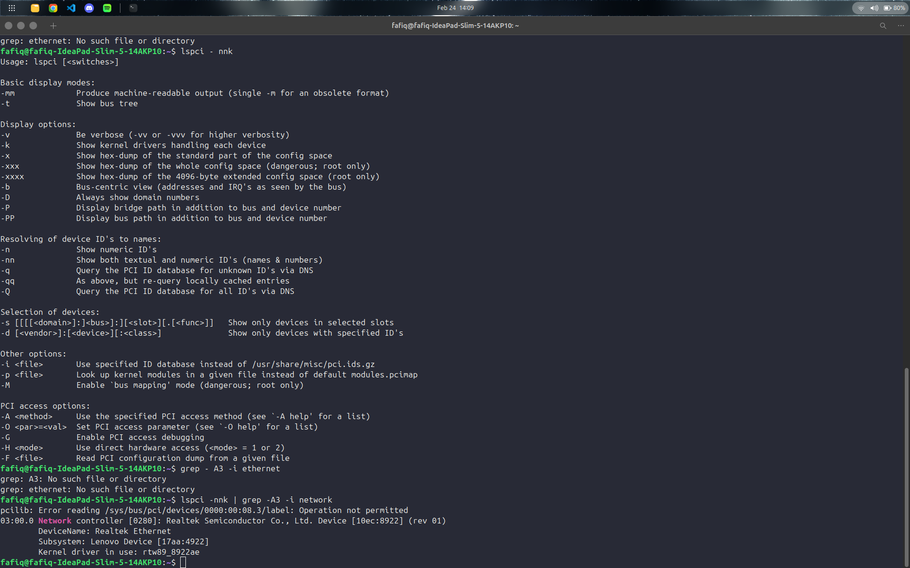
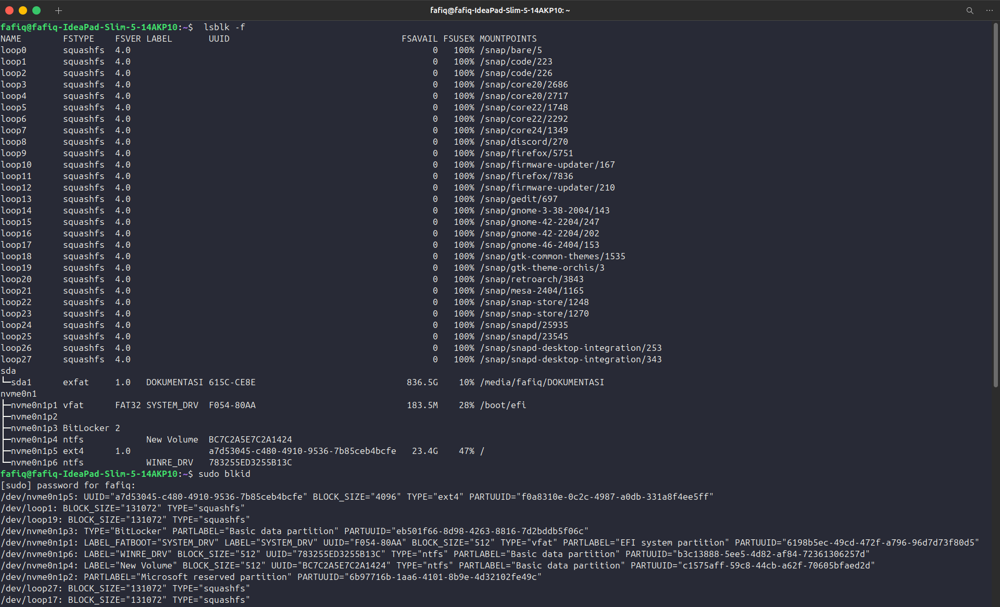
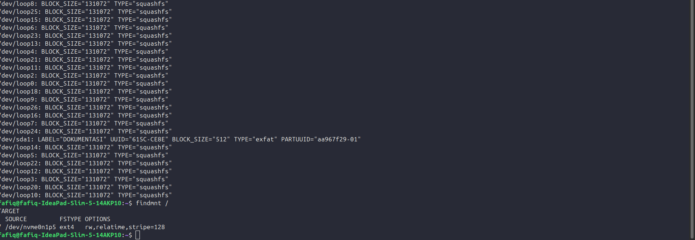
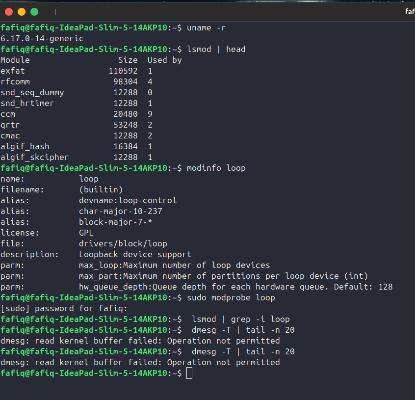

# Laporan Praktikum Sistem Operasi Jobsheet 2

<h4>Nama  : Fafiq Lutfi Azana<h4>
<h4>NIM   : 254107020058<h4>
<h4>Kelas : TI-1G<h4>

## 2.1 Percobaan 1: Identifikasi CPU dan Memori

### Latihan 2.1
Catat: (1) jumlah CPU(s), core/thread, (2) total RAM, (3) total swap. Jelaskan perbedaan RAM vs swap dalam 2–3 kalimat.

### Jawaban latihan 2.1
1. Jumlah CPU(s) pada perangkat adalah 16, jumlah corenya adalah 8, dan jumlah thread nya adalah 2 setiap core, yang artinya perangkat ini memiliki 16 thread.

## 2.2 Percobaan 2: Identifikasi Perangkat PCI/USB dan Driver

### Latihan 2.2
Temukan 1 perangkat PCI (misal NIC) dan tuliskan: Vendor:Device ID (angka
heksadesimal), nama driver/modul kernel, dan deskripsi singkat fungsinya.

### Jawaban latihan 2.2
Perangkat         : Network controller (NIC Wi-Fi)
Vendor:Device ID  : 10ec:8922
10ec              : vendor Realtek Semiconductor
8922              : ID perangkat Wi-Fi Realtek
Driver            : rtw89_8922a
Perangkat ini adalah kartu jaringan nirkabel atau Wi-Fi yang memungkinkan laptop terhubung ke internet melalui router atau access point tanpa menggunakan kabel. Selain itu, perangkat ini juga sering kali mendukung fitur Bluetooth yang diintegrasikan dalam chipset yang sama.

## 2.3 Percobaan 3: Identifikasi Storage dan Filesystem

## 2.4 Percobaan 4: Melihat Modul Aktif dan Informasinya

