# Laporan Praktikum Sistem Operasi Jobsheet 2

<h4>Nama  : Fafiq Lutfi Azana<h4>
<h4>NIM   : 254107020058<h4>
<h4>Kelas : TI-1G<h4>

## 2.1 Percobaan 1: Identifikasi CPU dan Memori

### Latihan 2.1
Catat: (1) jumlah CPU(s), core/thread, (2) total RAM, (3) total swap. Jelaskan perbedaan RAM vs swap dalam 2–3 kalimat.

### Jawaban latihan 2.1
1. Jumlah CPU(s) pada perangkat adalah 16, jumlah corenya adalah 8, dan jumlah thread nya adalah 2 setiap core, yang artinya perangkat ini memiliki 16 thread.

## 2.2 Percobaan 2: Identifikasi Perangkat PCI/USB dan Driver

### Latihan 2.2
Temukan 1 perangkat PCI (misal NIC) dan tuliskan: Vendor:Device ID (angka
heksadesimal), nama driver/modul kernel, dan deskripsi singkat fungsinya.

### Jawaban latihan 2.2
Perangkat         : Network controller (NIC Wi-Fi)
Vendor:Device ID  : 10ec:8922
10ec              : vendor Realtek Semiconductor
8922              : ID perangkat Wi-Fi Realtek
Driver            : rtw89_8922a
Perangkat ini adalah kartu jaringan nirkabel atau Wi-Fi yang memungkinkan laptop terhubung ke internet melalui router atau access point tanpa menggunakan kabel. Selain itu, perangkat ini juga sering kali mendukung fitur Bluetooth yang diintegrasikan dalam chipset yang sama.

## 2.3 Percobaan 3: Identifikasi Storage dan Filesystem

## 2.4 Percobaan 4: Melihat Modul Aktif dan Informasinya

## 2.5 Percobaan 5: Konfigurasi Auto-load dan Blacklist
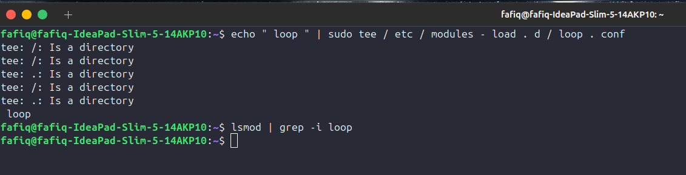

## 2.6 Percobaan 6 Mengenali Block vs Character Device
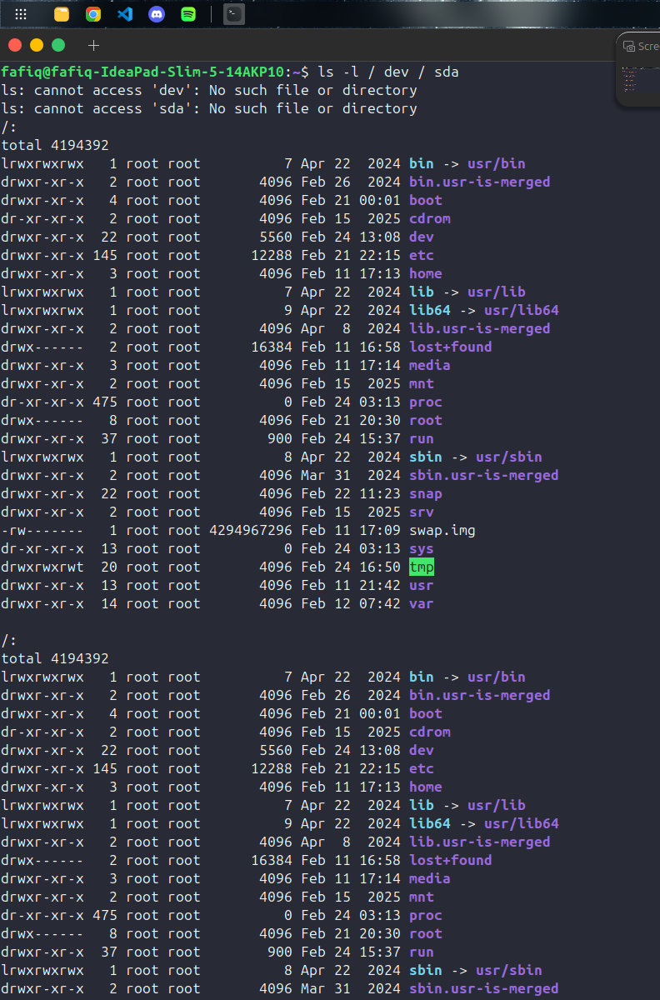
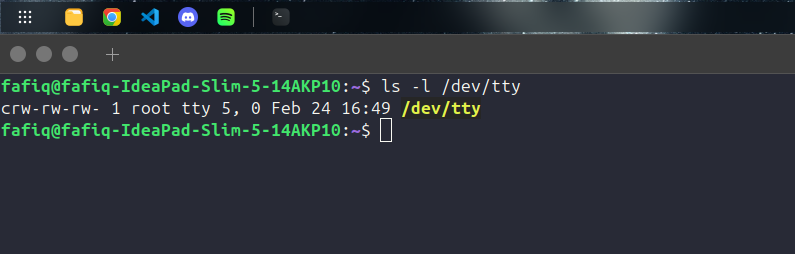
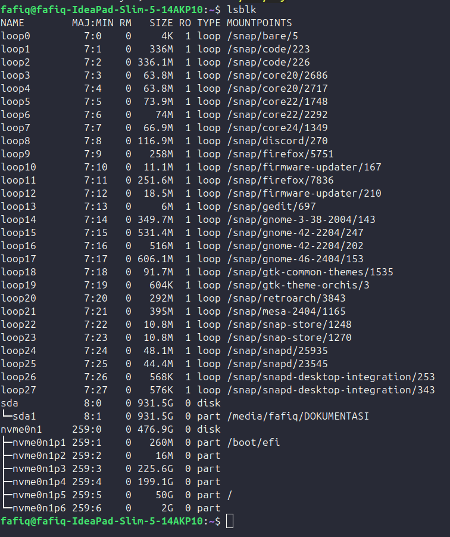

### Latihan 2.3
Dari output ls -l, jelaskan perbedaan penanda file untuk block device dan character device. (Hint: karakter pertama pada permission string)

### Jawaban Latihan 2.3
Pada ls -l karakter pertama pada permission String menunjukan tipe file
jika karakter pertama c berarti character device. yaitu perangkat yang mengirim dan menerima data dalam bentuk aliran karakter secara berurutan, seperti terminal, keyboard, atau port serial.
jika karakter pertama b berarti block device. yaitu perangkat yang memproses data dalam blok-blok sehingga mendukung akses acak dan buffering, seperti hard disk, SSD, atau flashdisk.
Dengan demikian, perbedaan utama antara penanda c dan b pada output ls -l terletak pada cara perangkat menangani data

## 2.7 Percobaan 7: Melihat Informasi udev
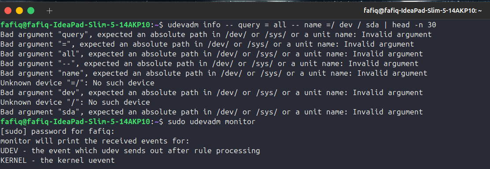

## 2.8 Percobaan 8: Membuat Workspace Praktikum
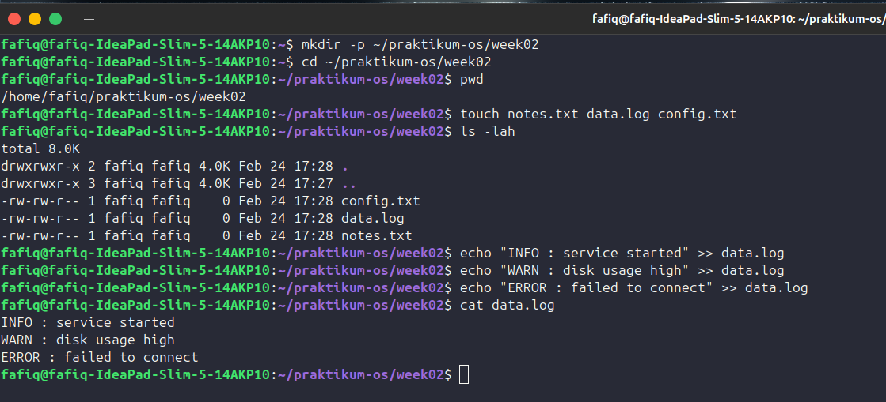
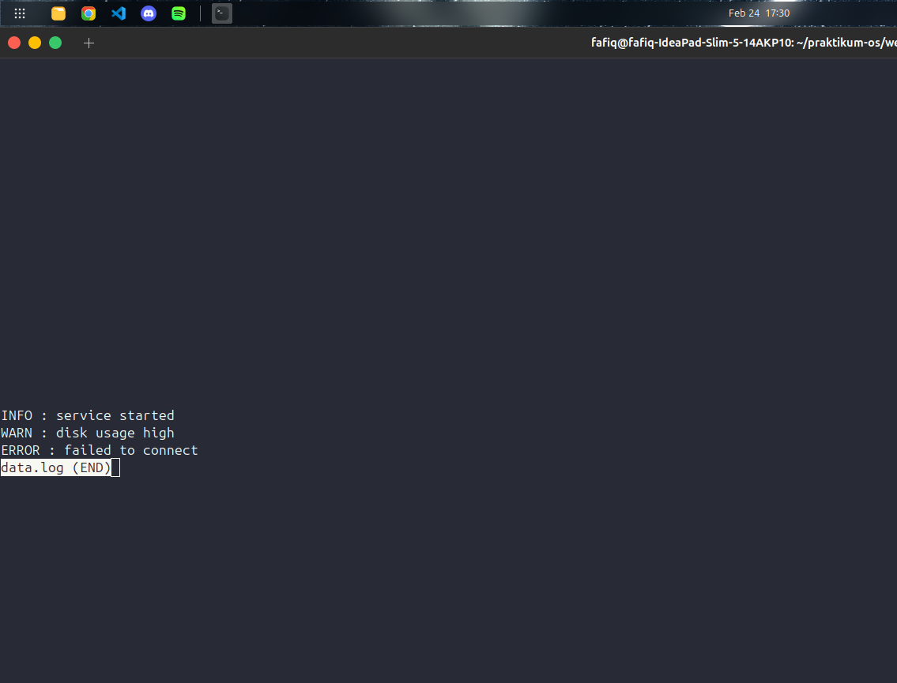

## 2.9 Percobaan 9: Pencarian Pola dengan grep
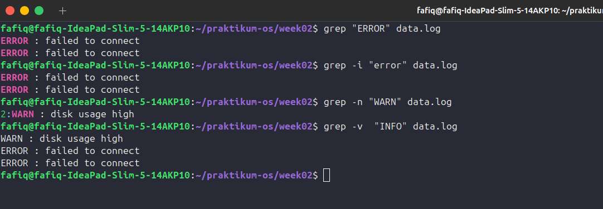

### Latihan 2.4
Gunakan grep untuk menampilkan hanya baris yang mengandung INFO atau WARN dari data.log. (Hint: gunakan grep -E dengan pola alternatif)

### Jawaban Latihan 2.4
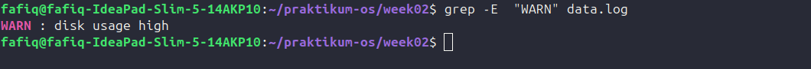

## 2.10 Percobaan 10: Substitusi dengan sed (Aman di File Latihan)
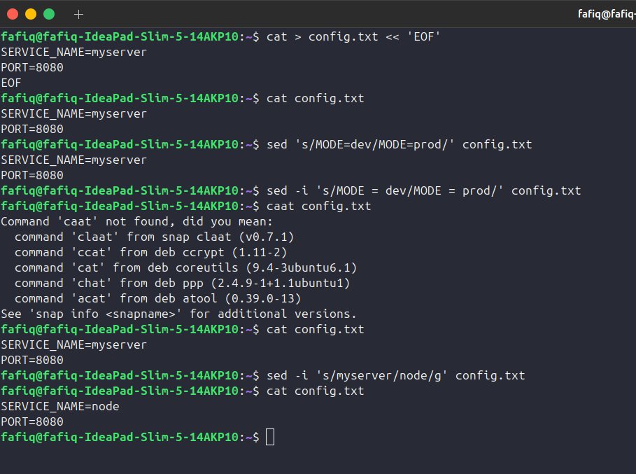

## 2.11 Percobaan 11: Ekstraksi Kolom dengan awk
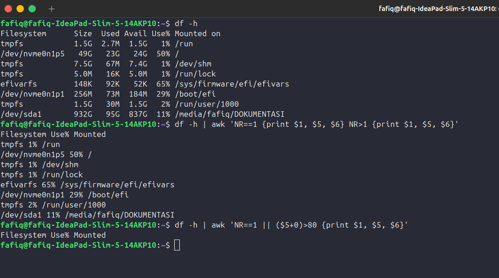

## 2.12 Percobaan 12: Melihat Proses dengan ps
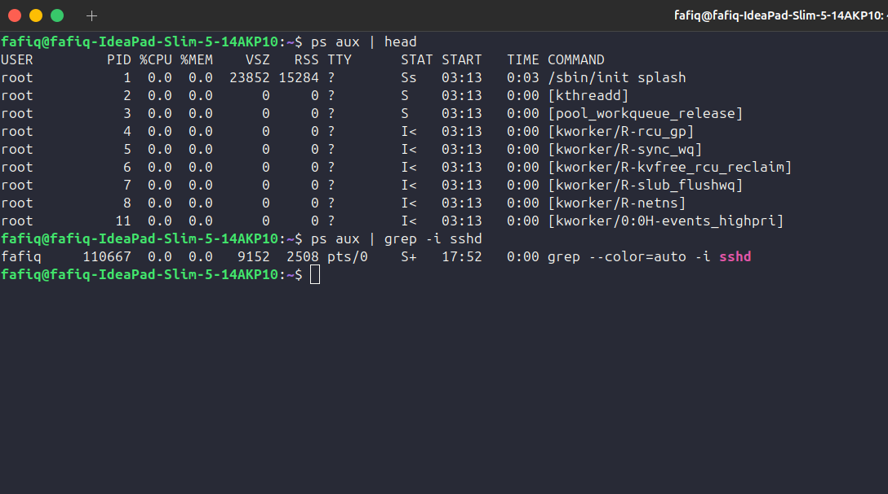

## 2.13 Percobaan 13: Monitoring Real-time dengan top
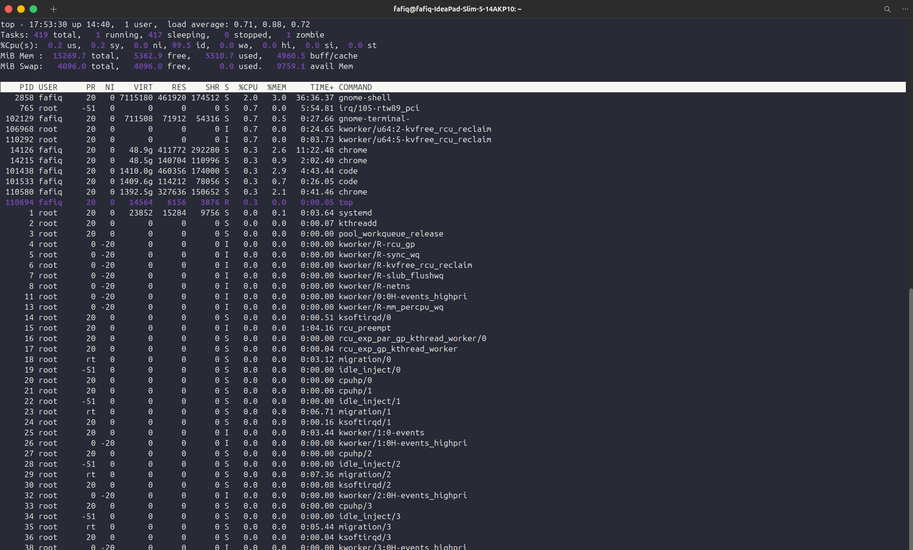

## 2.14 Percobaan 14: Menghentikan Proses dengan kill
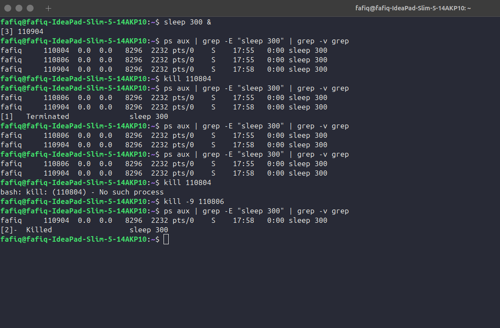

## 2.15 Percobaan 15: Cek Disk, Load, dan Service
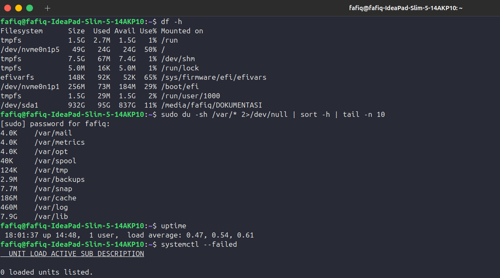

## 2.16 Percobaan 16: Monitoring Port dan Koneksi
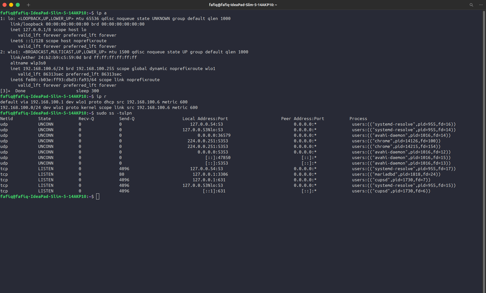

### Latihan 2.5
### Jawaban Latihan 2.5
### Latihan