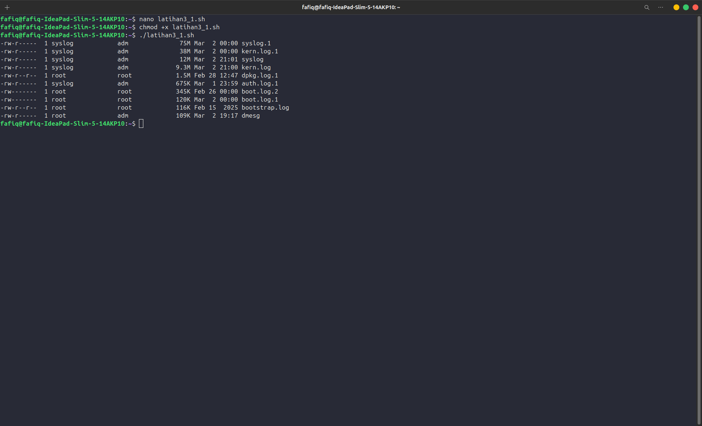
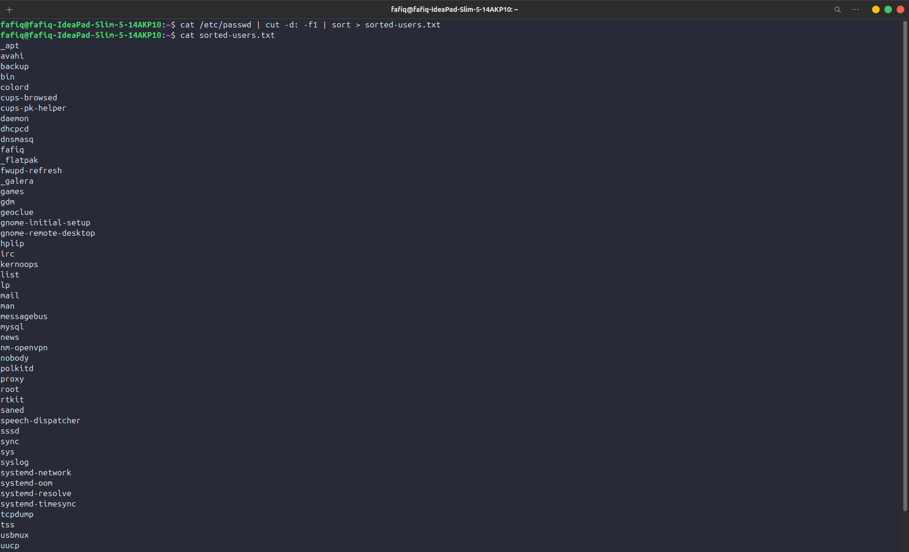
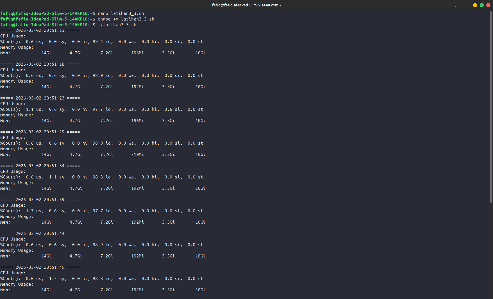
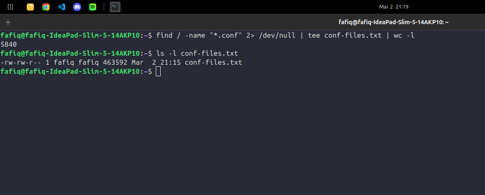
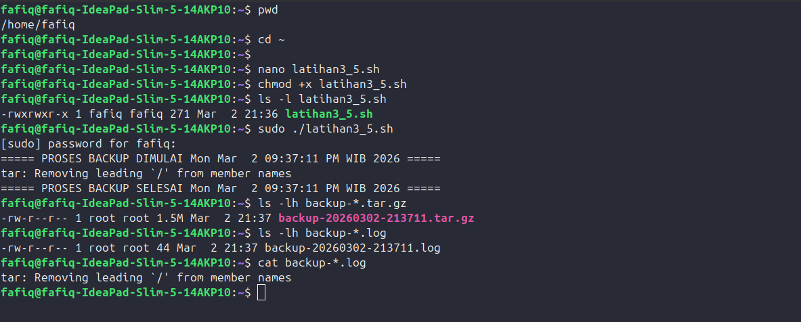

# Laporan Praktikum Sistem Operasi Jobsheet 3

<h4>Nama  : Fafiq Lutfi Azana<h4>
<h4>NIM   : 254107020058<h4>
<h4>Kelas : TI-1G<h4>

# Latihan 1.11

## Latihan 3.1
Buatlah script yang:
1. Menampilkan daftar 10 file terbesar di direktori /var/log/
2. Menyimpan hasilnya ke file large-logs.txt
3. Menampilkan output juga di terminal menggunakan tee
4. Menangani error dengan redirect ke error.log

### Hasil: 


### Script: 
```
#!/bin/bash

ls -lh /var/log/ 2> error.log | \
sort -k5 -rh | \
head -10 | \
tee large-logs.txt
```

## Latihan 3.2
Buat pipeline yang:
1. Membaca /etc/passwd
2. Mengekstrak username (kolom pertama)
3. Mengurutkan alfabetis
4. Menyimpan ke file sorted-users.txt
Hint: Gunakan cut, sort, dan operator redirect.

### Hasil:



### pipeline:
```
cat /etc/passwd | cut -d: -f1 | sort > sorted-users.txt
```

## Latihan 3.3
Tulis script monitoring yang:
1. Mencatat penggunaan CPU dan memory setiap 5 detik
2. Menyimpan log dengan timestamp
3. Berjalan selama 1 menit (12 iterasi)
4. Output ditampilkan di terminal DAN disimpan ke file

### Hasil:


### Script:
```
#!/bin/bash

LOGFILE="monitor-$(date +%Y%m%d-%H%M%S).log"

for i in {1..12}
do
    echo "===== $(date '+%Y-%m-%d %H:%M:%S') ====="
    
    echo "CPU Usage:"
    top -bn1 | grep "Cpu(s)"
    
    echo "Memory Usage:"
    free -h | grep Mem
    
    echo ""
    
    sleep 5
done | tee "$LOGFILE"
```
## Latihan 3.4
Buat perintah yang:
1. Mencari semua file .conf di sistem
2. Membuang pesan "Permission denied"
3. Menghitung jumlah file yang ditemukan
4. Menyimpan daftar path lengkap ke file

### Hasil: 


### Perintah: 
```
find / -name "*.conf" 2> /dev/null | tee conf-files.txt | wc -l

```

## Latihan 3.5
Implementasikan script backup yang:
1. Menggunakan tar untuk backup direktori
2. Menampilkan progress dengan tee
3. Mencatat stdout ke backup-success.log
4. Mencatat stderr ke backup-error.log
5. Menambahkan timestamp di setiap log entry

### Hasil: 


### Script:
```
#!/bin/bash

TIMESTAMP=$(date +%Y%m%d-%H%M%S)
BACKUP_FILE="backup-$TIMESTAMP.tar.gz"
LOG_FILE="backup-$TIMESTAMP.log"

echo "===== PROSES BACKUP DIMULAI $(date) ====="

tar -czf "$BACKUP_FILE" /etc 2>&1 | tee "$LOG_FILE"

echo "===== PROSES BACKUP SELESAI $(date) ====="
```